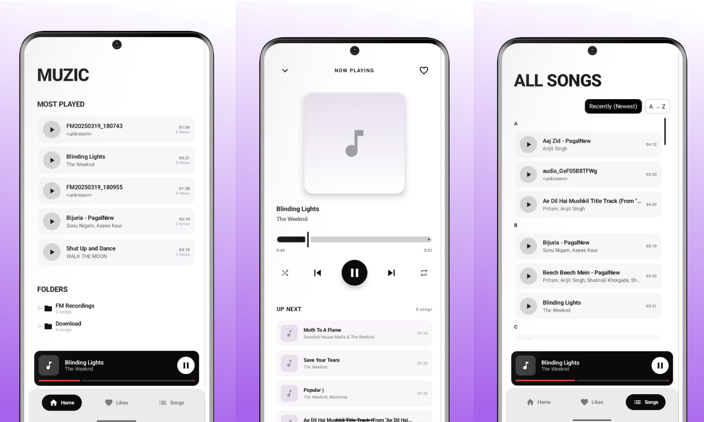

# Muzic

Minimalistic music player

## Why muzic?

- **Minimal Design**: A clean, uncluttered interface focused purely on audio navigation without unnecessary UI elements.
- **Lightweight & Fast**: Highly resource-efficient, ensuring smooth playback with minimal battery and memory consumption.
- **Hides Album Art**: Deliberately omits album artwork to maintain a visually calm, uniform, and minimal experience.
- **Distraction-Free**: Free of recommendations, feeds, or bloat—delivering an uninterrupted, straightforward listening experience.

## Installation / Download

- Download the latest APK from the Releases page: https://github.com/localhost969/muzic/releases
- Or build from source:
  1. Open the project in Android Studio.
  2. Build and run the `app` module on an emulator or device.

---

